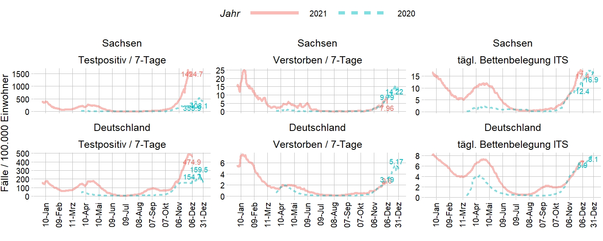
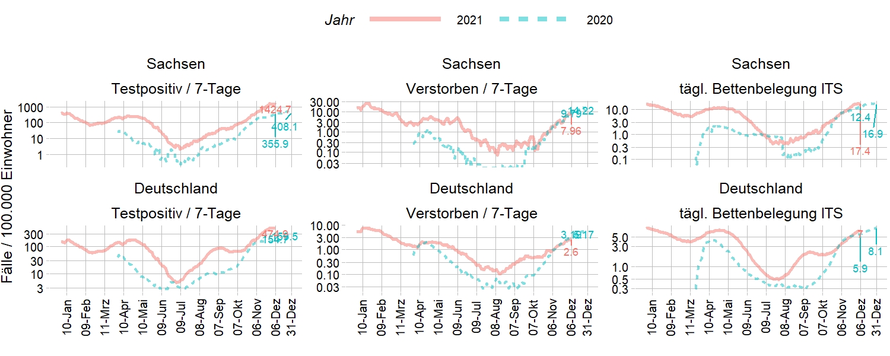
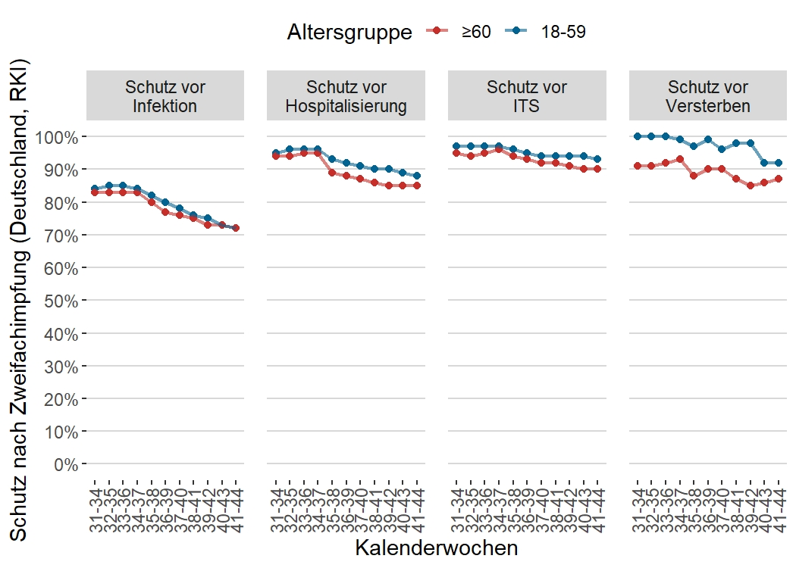

# IMISE Epidemiologisches Bulletin 19

Analysecode und Aktualisierungen von Grafiken des Epidemiologischen Bulletins 19 des IMISE der Universität Leipzig. Das Bulletin 19 ist [hier](https://github.com/GenStatLeipzig/IMISE-Epidemiologisches-Bulletin-19/raw/main/IMISE_Bulletin_19_2021_11_01.pdf) verfügbar, vorherige Versionen [hier.](https://github.com/GenStatLeipzig/IMISE-Epidemiologisches-Bulletin-19/tree/main/all_bulletin_pdf "https://github.com/GenStatLeipzig/IMISE-Epidemiologisches-Bulletin-19/tree/main/all_bulletin_pdf").

### Aktualisierung Abb. 1: Verlauf der COVID-19 Testpositiven in Deutschland und Sachsen nach Altersgruppe.

*Verlauf der COVID-19 Testpositiven in Deutschland und Sachsen nach Altersgruppe. Die schwarze Linie entspricht dem Durchschnitt der Gesamtbevölkerung. In Sachsen ist das langanhaltende exponentielle Wachstum (i.e. stetige Verdoppelung der Fallzahlen in der gleichen Zeiteinheit) deutlich als linearer Anstieg in der hier gewählten logarithmischen Skaleneinteilung sichtbar. (Datenquelle: RKI nach Meldedatum, aggregiert vom KIT - Karlsruher Institut für Technologie*

### Abb. 2: Vergleich der berichteten COVID-19 Testpositiven nach Impfstatus in Sachsen

Dieser Plot wird nicht aktualisiert. Hintergrund ist, dass es in dieser Darstellung zu viele Personen mit unbekannten Impfstatus geben könnte, vgl. [Bericht aus Baden Württemberg](https://www.stuttgarter-zeitung.de/inhalt.pandemie-corona-zahlen-ungeimpfter-sind-hoeher-als-die-von-geimpften.21a2fb8d-a3f3-486f-8cf5-64a5fa4b7ca9.html)

### Aktualisierung Abb.3: Vergleich Infektionsgeschehen 2021 vs. 2020

*Vergleich der Testpositiven, Verstorbenen und der ITS-Bettenbelegung 2021 vs. 2021. Das Infektionsgeschehen ist in all diesen drei Bereichen in 2021 bisher stärker als in 2020. Datenquelle: DIVI, RKI nach Meldedatum*

Gleiche Daten in logarithmischer Skaleneinteilung:

### Aktualisierung Abb. 7: Aktuelle Entwicklung des Impfschutzes in Deutschland

*Aktuelle Entwicklung des Impfschutzes in Deutschland: Dargestellt sind die Werte für die angegebenen Kalenderwochen. Die meisten Impfungen erfolgten in Deutschland bereits ab der 13. Kalenderwoche (RKI). Etwa 20 Wochen danach beginnt der Schutz vor Infektion zu sinken. Datenquelle: RKI Wochenberichte*

### Code für Abb. 10: Szenarien zur Abschätzung der zu erwartenden weiteren COVID-19 Verstorbenen in Sachsen.

Der Analysecode ist unter *scripte\\b19_s08_18_weitereSterblichkeit.R verfügbar,* weitere zu Grunde liegende Annahmen sind im [Bulletin 19](https://github.com/GenStatLeipzig/IMISE-Epidemiologisches-Bulletin-19/raw/main/IMISE_Bulletin_19_2021_11_01.pdf) aufgeführt.

*Verstorbenen in Sachsen. Die vertikalen Linien kennzeichnen den 95% Unsicherheitsbereich der jeweiligen Schätzung, der Querbalken den medianen Schätzwert zukünftig Verstorbener (Wert in der Mitte). Gezeigt ist sowohl die gesamte Abschätzung der über 60-Jährigen als auch für die 60-79-Jährigen bzw. über 80-Jährigen separat.*

Hinweis: Wenn die Erstellerin dieser Website feststellt oder von anderen darauf hingewiesen wird, dass ein konkretes Angebot, zu dem sie einen Link bereitgestellt hat, eine zivil- oder strafrechtliche Verantwortlichkeit auslöst, wird sie den Verweis auf dieses Angebot aufheben.
